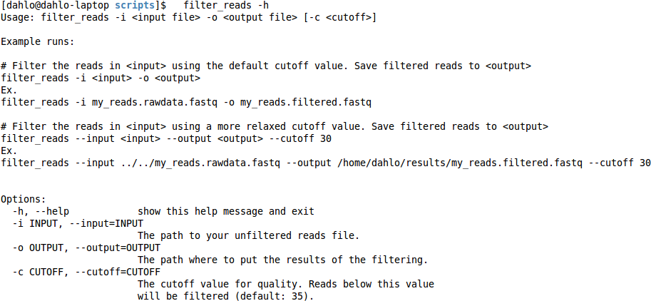
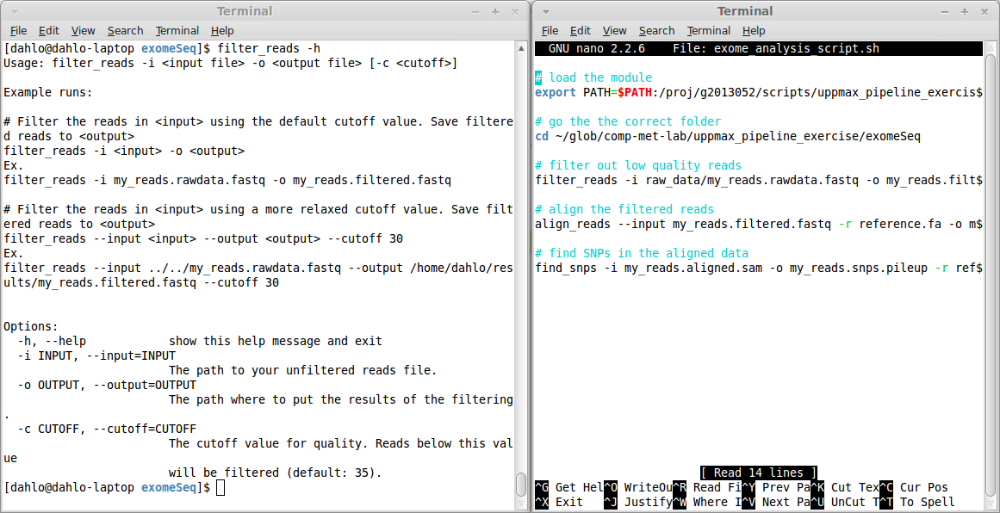
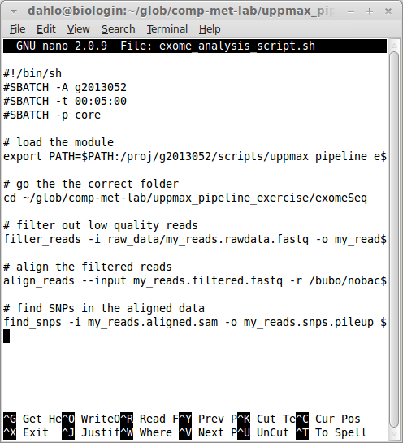

# UPPMAX Pipeline Exercise
**NOTE:** in syntax examples, the dollar sign ($) is not to be printed.
The dollar sign is usually an indicator that the text following it should be typed in a terminal window.

## 1. Connecting to UPPMAX
The first step of this lab is to open a ssh connection to UPPMAX.
You will need a ssh program to do this:

On Linux: it is included by default, named **Terminal**.

On OSX: it is included by default, named **Terminal**.

On Windows: [Google MobaXterm](http://bit.ly/19yaQOM) and download it.

Fire up the available ssh program and enter the following (replace **username** with your uppmax user name).
-Y means that X-forwarding is activated on the connection, which means graphical data can be transmitted if a program requests it, i.e. programs can use a graphical user interface (GUI) if they want to.

```bash
$ ssh -Y username@milou.uppmax.uu.se
```

and give your password when prompted.
As you type, nothing will show on screen.
No stars, no dots.
It is supposed to be that way.
Just type the password and press enter, it will be fine.

Now your screen should look something like this:


## 2. Getting a node of your own (only if you canceled your job before lunch)
Usually you would do most of the work in this lab directly on one of the login nodes at uppmax, but we have arranged for you to have one core each to avoid disturbances.
This was covered briefly in the lecture notes.

<font color='red'>Check with squeue -u username if you still have your reservation since before lunch running.
If it is running, skip this step and connect to that reservation.</font>

(We only have 30 reserved cores, so if someone has two, someone else will not get one..)

```bash
# ONLY IF YOU DON'T ALREADY HAVE AN ACTIVE ALLOCATION SINCE BEFORE
$ salloc -A g2016017 -t 04:30:00 -p core -n 1 --no-shell --reservation=g2016017_monday &
```

check which node you got (replace **username** with your uppmax user name)

```bash
$ squeue -u username
```

should look something like this


where **q34** is the name of the node I got (yours will probably be different).
Note the numbers in the Time column.
They show for how long the job has been running.
When it reaches the time limit you requested (4.5 hours in this case) the session will shut down, and you will lose all unsaved data.
Connect to this node from within uppmax.

```bash
$ ssh -Y q34
```

**Note:** there is a uppmax specific tool called jobinfo that supplies the same kind of information as squeue that you can use as well (```$ jobinfo -u username```).

## 3. Copying files needed for laboratory
To be able to do parts of this lab, you will need some files.
To avoid all the course participants editing the same file all at once, undoing each other's edits, each participant will get their own copy of the needed files.
The files are located in the folder `/dev/shm/ngsintro/uppmax_pipeline_exercise/data`

Next, copy the lab files from this folder.
-r means recursively, which means all the files including sub-folders of the source folder.
Without it, only files directly in the source folder would be copied, NOT sub-folders and files in sub-folders.

**NOTE: Remember to tab-complete to avoid typos and too much writing.**

Ex.

```bash
$ cp -r <source> <destination>

$ cp -r /dev/shm/ngsintro/uppmax_pipeline_exercise/data ~/glob/ngs-intro/uppmax_pipeline_exercise
```

Have a look in `~/glob/ngs-intro/uppmax_pipeline_exercise`:

```bash
$ cd ~/glob/ngs-intro/uppmax_pipeline_exercise

$ ll
```
If you see files, the copying was successful.

## 4. Running dummy pipelines
Most of the work you will do in the future will be about running multiple programs after each other.
This can be done manually, with you sitting by the computer and typing commands, waiting for them to finish, then start the next program.
But what happens if the first program finished sometime during the night? You will not be there to start the next program, and the computer will stand idle until you have time to start the program.
To avoid this, scripts can be used.
First, we'll do an analysis manually without scripts, just to get the hang of it.
Then we'll start writing scripts for it!

### Load the module
In this exercise, we'll pretend that we are running analyses.
This will give you a peek at what running programs in linux is like, and get you ready for the real stuff during the week!

The first thing you usually do is to load the modules for the programs you want to run.
During this exercise we'll only run my dummy scripts that don't actually do any analysis, so they don't have a module of their own.
What we can do instead is to manually do what module loading usually does: to modify the **$PATH variable**.

The $PATH variable specifies directories where the computer should look for programs.
For instance, when you type

```bash
$ nano
```

how does the computer know which program to start? You gave it the name 'nano', but that could refer to any file named nano in the computer, yet it starts the correct one every time.
The answer is that it looks in the directories stored in the $PATH variable.

To see which directories that are available by default, type

```bash
$ echo $PATH
```

It should give you something like this, a list of directories, separated by colon signs:


Try loading a module, and then look at the $PATH variable again.
You'll see that there are a few extra directories there now, after the module has been loaded.

```bash
$ module load bioinfo-tools samtools
$ echo $PATH
```


To pretend that we are loading a module, we will just add a the directory containing my dummy scripts to the $PATH variable, and it will be like we loaded the module for them.

```bash
$ export PATH=$PATH:/dev/shm/ngsintro/uppmax_pipeline_exercise/dummy_scripts
```

This will set the $PATH variable to whatever it is at the moment, and add a directory at the end of it.
Note the lack of a dollar sign infront of the variable name directly after "export".
You don't use dollar signs when  **assigning**  values to variables, and you always use dollar signs when **getting** values from variables.

**IMPORTANT:** The export command affects only the terminal you type it in.
If you have 2 terminals open, only the terminal you typed it in will have a modified path.
If you close that terminal and open a new one, it will not have the modified path.

Enough with variables now.
Let's try the scripts out!

## Running the programs
Let's pretend that we want to run an exome analysis.
You will learn how to do this for real later this week.
This kind of analysis usually has the following steps:

1. Filter out low quality reads.
1. Align the reads to a reference genome.
1. Find all the SNPs in the data.

To simulate this, I have written 3 programs:

* filter_reads
* align_reads
* find_snps

To find out how to run the programs type

```bash
$ <program name> -h
```

```bash
or
$ <program name> --help
```

This is useful to remember, since most programs has this function.
If you do this for the filter program, you get



This help text tells you that the program has to be run a certain way.
The options -i and -o are mandatory, since they are explicitly written.
The hard brackets [ ] around "-c <cutoff>" means that the cutoff value is NOT mandatory.
They can be specified if the user wishes to change the cutoff from the default values.

Further down, in the "Options:" section, each of the options are explained more in detail.
You can also see that each option can be specified in two way, a short and a long format.
The cutoff value can be specified either by the short "-c", or the long "--cutoff".
It doesn't matter which format you choose, it's completely up to you, which ever you feel more comfortable with.

Right, so now you know how to figure out how to run programs (just type the program name, followed by a -h or --help).
Try doing a complete exome sequencing analysis, following the steps below.

First, go to the exome directory in the lab directory that you copied to your glob in step 2 in this lab:

```bash
$ cd ~/glob/ngs-intro/uppmax_pipeline_exercise/exomeSeq
```

In there you will find a folder called `raw_data`, containing a fastq file: `my_reads.rawdata.fastq` .
This file contains the raw data that you will analyse.

* Filter the raw data using the program `filter_reads`, to get rid of low quality reads.
* Align the filtered reads with the program `align_reads`, to the human reference genome located here:

```bash
/sw/data/uppnex/reference/Homo_sapiens/hg19/concat_rm/Homo_sapiens.GRCh37.57.dna_rm.concat.fa
```  

* Find SNPs in your aligned data with the program `find_snps`.
To find SNPs we have to have a reference to compare our data with.
The same reference genome as you aligned to is the one to use.


Do one step at a time, and check the --help of the programs to find out how they are to be run.
Remember to name your files logically so that you don't confuse them with each other.

Most pipelines work in a way where the output of the current program is the input of the next program in the pipeline.
In this pipeline, raw data gets filtered, the filtered data gets aligned, and the aligned data gets searched for SNPs.
The intermediate steps are usually not interesting after you have reached the end of the pipeline.
Then, only the raw data and the final result is important.

## 5. Scripting a dummy pipeline
To run the pipeline in a script, just do exactly as you just did, but write the exact same commands to a file instead of directly to the terminal.
When you run the script, the computer will run the script one line at a time, until it reaches the end of the file.
Just like you did manually in the previous step.

The simplest way to work with scripts is to have 2 terminals open.
One will have "nano" started where you write your script file, and the other will be on the command line where you can test your commands to make sure they work before you put them in the script.
When you are sure a command works, you copy/paste it to the terminal with the script file in it.

Start writing you script with nano:

```bash
$ cd ~/glob/ngs-intro/uppmax_pipeline_exercise/exomeSeq
$ nano exome_analysis_script.sh
```

The .sh ending is commonly used for **sh**ell scripts which is what we are creating. The default shell at UPPMAX is as we know called bash, so whenever we write `sh` the computer will use bash. If the default shell at UPPMAX would change for some reason, mayby to zsh or any other type of shell, `sh` would point the the new shell instead.



Since our memory is far from perfect, try to **always comment your scripts**.
The comments are rows that start with a hash sign, # These lines will not be interpreted as a command to be run, they will just be skipped.
They are only meant for humans to read, and they are real lifesavers when you are reading old scripts you have forgotten what they do.
Commands are hard for humans to read, so try to write a couple of words explaining what the command below does.
You'll be thankful later!

When you are finished with your script, you can test run it.
To do that, use the program sh:

```bash
$ sh exome_analysis_script.sh
```

If you got everything right, you should see the whole pipeline being executed without you having to start each program manually.
If something goes wrong, look at the output and try to figure out which step in the pipeline that get the error, and solve it.
A tip is to read the error list from the top-down.
An error early in the pipeline will most likely cause a multitude of error further down the pipeline, so your best bet is to start from the top.
Solve the problem, try the script again, until it works.
The real beauty of scripts is that they can be re-run really easily.
Maybe you have to change a variable or option in one of the early steps of the pipeline, just do it and re-run the whole thing.

## 6. Submitting a dummy pipeline
The whole point with computer centres like UPPMAX is that you can run multiple programs at the same time to speed things up.
To do this efficiently you will have to submit jobs to the queue system.
As you saw in yesterdays exercise, it is ordinary shell scripts that you submit to the queue system, with a couple of extra options in the beginning.
So to be able to submit our script to the queue system, the only thing we have to do is to add the queue system options in the beginning of the script.

The options needed by the queue are, as we learned yesterday:

* Who is paying for the job?
* How long time will the job need?
* How many cores does the job need?

SLURM is also a bit strict when it comes formalities.
It requires that you specify which program should be used to run the submitted script file.
The standard program for this is bash, but we have to specify it on the first line of the script non the less.
This is done by having the first line in the script looking link this:

```bash
#!/bin/bash -l
```

This is how Linux knows which program should open a file, since it does not care about the file ending like Windows commonly does (.ppt, .pdf, .html might be familiar file endings).
The #! indicates that the next words will be the path to the program that should open the file.
It could be #!/bin/bash, or #!/bin/python, or any other path to a executable program.
(The -l after bash is a flag that tells bash that the script should be treated as a login shell, so everything behaves as when you are logged in.
Without it commands like `module` and some other would not work.
If it's not a login shell, it's running as a script, and then it does not need to bother making the interface human friendly so it will skip things to make it start faster and consume less resources.)

The next couple of rows will contain all the options you want to give SLURM:

```bash
#!/bin/bash -l
#SBATCH -A g2016017
#SBATCH -t 00:05:00
#SBATCH -p core
```

SLURM options always start with **#SBATCH** followed by a flag (-A for account, -t for time, -p for partition) and the value for that flag.
Your script should now look something like this (ignore the old project id and path to the scripts):



To submit this script to the queue:

```bash
$ sbatch exome_analysis_script.sh
```

## 7. RNAseq Analysis
The next step is to do a complete RNAseq analysis.
The steps involved start off just like the exome analysis, but has a few extra steps.
The goal of this part is to successfully run the pipeline using the queue system.
To do this, you must construct the commands for each step, combine them in a script, include the SLURM options, and submit it.
Much like what we did in the previous step, but with some complications.

Typical RNAseq analysis consists of multiple samples / time points:

* Filter the reads for each sample.
* Align the filtered reads for each sample to the same reference genome as before.
* Do a differential expression analysis by comparing multiple samples.

The difficulty here is that you have not just 1 sample, you have 3 of them.
And they all need to be filtered and aligned separately, and then compared to each other.
The program that does the differential expression analysis in this exercise is called `diff_exp` and is located in the same directory as the previous scripts.

**Hints:**
The samples are filtered and aligned individually.
For the really fast ones: Continue with this tutorial on [advanced Linux](advanced-linux) if you still have time left on the lab.
Or just having a slow night at the hotel.
